# Worksheet 2 — Secure SDLC & Tooling (3 hrs)

> **Course:** Software Security (KOSEN69) · **Week 2**
> **Aligned to:** OWASP 2025 (A05 Injection [CWE-89, CWE-78], A04 Cryptographic Failures [CWE-327], A02 Security Misconfiguration [CWE-798, CWE-489]) · CWE-798, CWE-89, CWE-78, CWE-327, CWE-489
> **Signature game:** "Bug Triage Race" (scan → triage; score = true positives − misclassified)

> **Ethics note:** The scanners run only against the provided `vulnerable-repo/` on your own machine. Do not point SAST/secret scanners at third-party repos or production systems without authorization. Treat any secret you find here as fake lab data.

## Part 1 — Student Information
| Name | Student ID | Date | Group |
|---|---|---|---|
| Phurinath Janjirahpoonpon | 6631503033 | 5/9/69 | |

## Part 2 — Lecture Questions
Answer in your own words (2–4 sentences each).
1. Distinguish SAST, DAST, and SCA — what does each see, and when in the SDLC does each run?
Ans.  SAST: acts like a grammar checker, scanning the raw source code for weaknesses early in development. 
      DAST: acts like a hacker, attacking the running application later in the cycle to
find runtime flaws like server errors. 
      SCA: checks the third-party building blocks you import, looking for known
weaknesses in open-source libraries at any stage.
2. What is secret scanning, and why do hardcoded secrets keep ending up in repos?
Ans. Automated check that hunts for sensitive data, because developers often paste them for quick local testing and forget to remove them before saving their work
3. What does "shift-left / DevSecOps" mean in practice for a CI pipeline?
Ans. Moving security testing as early in the software creation timeline as possible, rather than treating it as a final hurdle before launch. If a vulnerability is found, the system immediately blocks the update, forcing the developer to fix the issue while the code is still new
4. Why is coverage-guided fuzzing considered the dominant modern bug-finding technique?
Ans. Because, it tracking which parts of the code the random inputs reach and mutating them to dig deeper into unexplored paths. This evolutionary approach allows it to reliably uncover hidden, complex bugs that human testers and basic scanners would never think to trigger
5. Define true positive vs. false positive in scanner triage, and why misclassifying both directions is costly.
Ans. True positive is a real security threat correctly identified by a scanner, while a 
false positive is a false alarm where perfectly safe code is flagged as dangerous, 
because an actual vulnerability is ignored and left wide open for attackers to exploit


## Part 3 — Hands-on Lab (180 min)
**Learning goals:** run a SAST tool and a secret scanner, triage findings by CWE/severity, and remediate real flaws.
**Prerequisites:** Docker installed; internet to pull the Semgrep/Gitleaks images.

**Environment setup**
```bash
cd labs/week02-sdlc-tooling
cat scan.sh                 # see exactly what it runs
bash scan.sh                # Semgrep (p/default + p/owasp-top-ten) then Gitleaks on ./vulnerable-repo
```
Target under scan: `vulnerable-repo/app.py` (plus `requirements.txt`). It contains five planted flaws.

**What to submit per task:** the command/payload run + a screenshot of the finding + a 2–3 sentence mitigation.

**Task 0 — Onboarding (5 min)** · *Goal:* confirm tooling. *Steps:* run `bash scan.sh`; confirm both Semgrep and Gitleaks sections produce output. *Deliverable:* screenshot showing both tools ran.
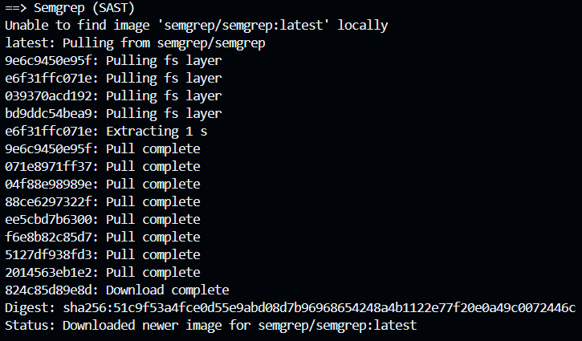 
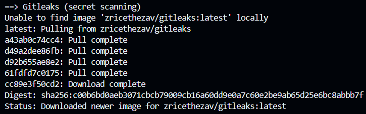

**Task 1 — SAST sweep with Semgrep (25 min)** · *Goal:* find code flaws. *Steps:* read the Semgrep output; locate the SQL injection in `/user` (CWE-89, string-formatted query), the OS command injection in `/ping` (CWE-78, `shell=True`), the weak `md5` password hash (CWE-327), and `debug=True` (CWE-489). *Deliverable:* one screenshot per finding with the file:line.
Ans. SQL injection: 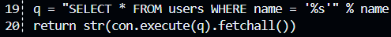 /src/app.py:19,20
OS command injection: 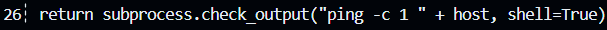 /src/app.py:26
Weak password hash: 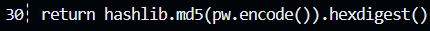 /src/app/py:30
Debug mode in production: 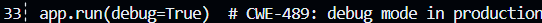 /src/app/py:33

**Task 2 — Secret scan with Gitleaks (15 min)** · *Goal:* find leaked credentials. *Steps:* read the Gitleaks output; identify `AWS_SECRET_ACCESS_KEY` and `DB_PASSWORD` (CWE-798). *Deliverable:* screenshot + the rule that fired for each.
Ans. AWS Secret: 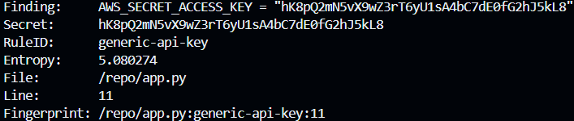 generic-api-key
DB Password: 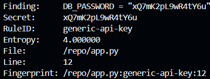 generic-api-key

**Task 3 — Bug Triage Race (30 min)** · *Goal:* triage accurately. *Steps:* build a table with columns *Tool | File:Line | CWE | Severity | TP/FP | Fix idea*; mark at least 3 true positives and 1 likely false positive and justify each. (Score = TP − misclassified.) *Deliverable:* the completed triage table.
Ans. 
  True Positives
    1) SQL Injection (CWE-89): The code blindly pastes user input straight into a database 
  command. This is dangerous because a hacker can type special characters to trick the database into handing over data it shouldn't.  
    2) OS Command Injection (CWE-78): The code uses a risky setting (shell=True) to run 
  system commands. This lets a hacker piggyback their own malicious commands onto the normal ones. 
    3) Weak Cryptography (CWE-327): The code uses MD5 to secure passwords. MD5 is 
  completely outdated, and hackers can easily crack it to read the original passwords.  
  False Positive
    1) Hardcoded Secret (CWE-798): The scanner flagged a password, but it's a false alarm. 
  Scanners are just looking for patterns, so they flag dummy data used for testing just like real passwords. Since this is a lab environment, it's not a real secret that could cause a breach.

**Task 4 — Fuzzing intro (10 min)** · *Goal:* see coverage-guided fuzzing find a bug SAST won't. *Steps:* in the `labs/toolbox` container (Apple clang has no libFuzzer runtime), build `clang -g -fsanitize=address,fuzzer harness.c -o fuzz`, then **seed the corpus** and run it:
`mkdir -p corpus && printf 'FUZ' > corpus/seed && ./fuzz corpus`. It crashes almost immediately with an AddressSanitizer heap-buffer-overflow at `harness.c:23` (the `data[3]` read with no `size > 3` check). Seeding matters: an unseeded `./fuzz` has to rediscover the magic bytes by chance and often finds nothing for minutes — that unpredictability is itself worth a sentence in your write-up. (The deep fuzzing+exploit lab is Week 11.) *Deliverable:* the ASan crash output (or a screenshot) + a 2-sentence note on why fuzzing finds this bug when a linter/SAST pass over the same 4-line check would not.
Ans.  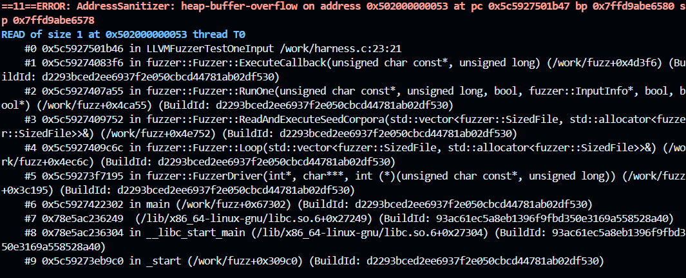 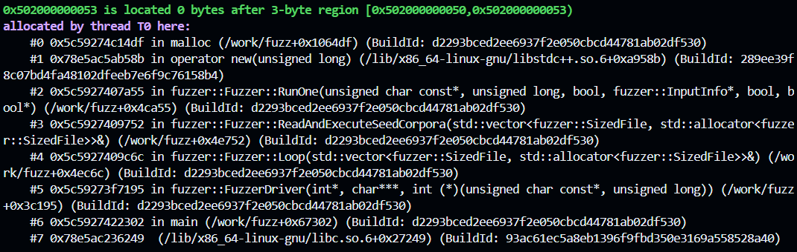 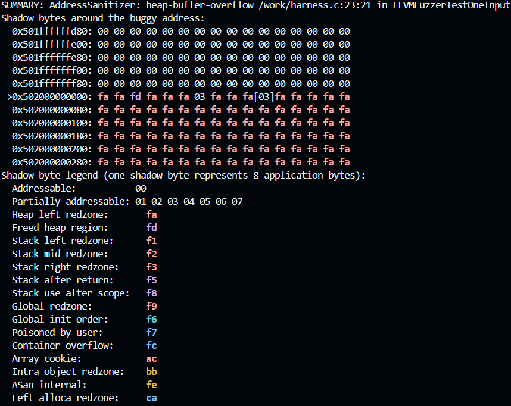 
      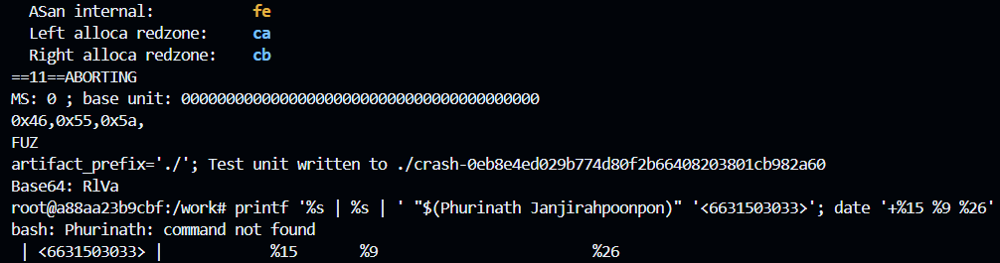
      SAST scanners miss this bug because they only check static code patterns and cannot
     predict dynamic runtime memory usage. Fuzzing catches it by actually executing the code with mutated inputs, triggering a physical crash exactly where the length check is missing.

**Task 5 — Scan the project target (40 min)** · *Goal:* apply the tools to your term project. *Steps:* run Semgrep + Gitleaks against **NoteVault** (`../../project/starter-app`); also run an SCA scan: `docker run --rm -v "$PWD/../../project/starter-app:/src" aquasec/trivy fs /src`. *Deliverable:* a findings list (tool, file:line/CVE, CWE) — reuse it in your project vuln report.
Ans. 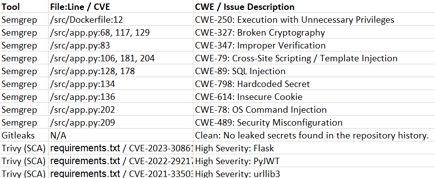

**Task 6 — Build a security CI gate (25 min)** · *Goal:* automate the scan (previews Week 15). *Steps:* adapt `../week15-devsecops-pipeline/security-ci.yml` into a workflow that runs Semgrep + Trivy + Gitleaks and **fails on HIGH/CRITICAL**; run it locally (`act`) or commit to your fork and read the Actions log. *Deliverable:* the workflow file + a screenshot of a failing run.
Ans. [text](../../.github/workflows/security-ci.yml) 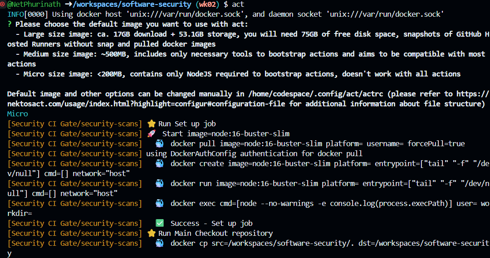 
  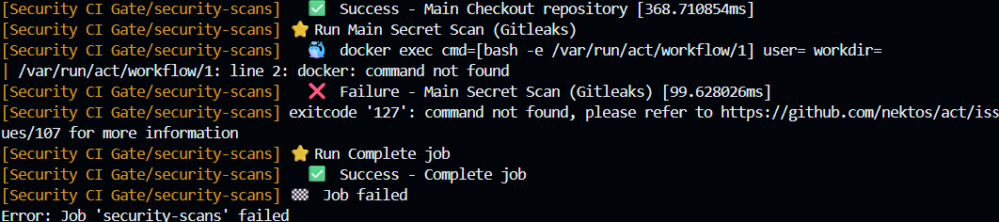

**Task 7 — SAST blind spots (20 min)** · *Goal:* see what scanners miss. *Steps:* find one real bug in `vulnerable-repo/app.py` (or NoteVault) that Semgrep did **not** flag, and explain why a pattern-based tool missed it. *Deliverable:* the bug + a 2-sentence explanation.
Ans.  In NoteVault (app.py, lines 68-69), there are hardcoded plaintext passwords 
  ("alicepw" and "admin123") inside the user array that Semgrep completely missed
      SAST tools rely on static patterns and lack the contextual awareness to understand 
    what a string actually means. Therefore, they cannot distinguish a normal text string from a hardcoded password unless it perfectly matches a predefined rule.

**Task 8 — Defend / fix it (10 min)** · *Goal:* remediate the planted flaws in `vulnerable-repo/app.py`. *Steps:* rewrite `/user` to use a parameterized query (`?` placeholder); remove `shell=True` and pass an argument list in `/ping`; move both secrets to environment variables; replace `md5` with bcrypt/argon2; set `debug=False`. *Deliverable:* a before/after diff for each fix mapped to its CWE.
Ans. 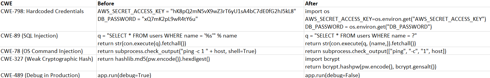

## Part 4 — Reflection
1. Map two of your findings to their CWE and to the matching OWASP 2025 category.
Ans.  1) SQL Injection (CWE-89): Maps to OWASP 2025 A05: Injection.
      2) Hardcoded Secrets (CWE-798): Maps to OWASP 2025 A02: Security Misconfiguration.
2. Name a real-world breach caused by a hardcoded/leaked secret or an injection flaw, and what control would have caught it pre-release.
Ans.  The 2022 Uber data breach resulted in a massive infrastructure takeover because 
  attackers found hardcoded admin credentials saved inside a PowerShell script on the company network. If Uber had required an automated Secret Scanner (like Gitleaks) as a CI/CD pipeline gate, it would have blocked the developer from saving that script with a real password inside it.
3. Which single tool (SAST vs. secret scanning) gave the highest-value findings on this repo, and why?
Ans.  SAST (Semgrep) provided the highest overall value for this specific repo. While 
  secret scanning is critical, it only looks for one specific thing (passwords/keys). Semgrep acted as a broader safety net, catching multiple different types of high-impact logic flaws—like OS Command Injection and SQL Injection—that would have allowed a hacker to completely take over the server.

## Grading rubric (100)
| Criterion | Points |
|---|---|
| Lecture questions (Part 2) | 20 |
| Exploitation + evidence (scan output + triage table + screenshots) | 40 |
| Defense (remediated `app.py` with before/after diffs) | 25 |
| Reflection (CWE/OWASP mapping + breach + tool value) | 15 |

---

## Evidence & Integrity (required)

- **Identity proof:** every screenshot/diagram must show a terminal running `printf '%s | %s | ' "$(whoami)" '<YOUR-STUDENT-ID>'; date '+%F %T %Z'` **in the
  same image as the evidence**. When the evidence is a browser page, a DevTools panel or a
  rendered response, put that terminal **beside the browser and capture the whole screen** — a
  cropped window carries nothing that identifies you, and the lab's own output is
  byte-identical for the whole cohort *by design*, so the stamp is the only thing that makes
  the shot yours. Generic or borrowed evidence is not accepted.
- **Personalized flag (if this lab issues one):** ____________________
  *Flags are unique per student — submitting another student's flag is a violation. How to submit: **learn.zcr.ai/submit** (full guide: `SUBMISSION.md` in the repo root).*
- **Explain in your own words** *(graded on your reasoning, not copied text):*
  1. What did you do, and **why did the vulnerability work**?
  2. **Why does your fix actually stop it** — and what could still break it?

---

## 🤖 Audit the AI (required)

AI is a power tool you must **distrust** — you are graded on your *critique*, not the AI's answer.

1. Ask an AI assistant to exploit **or** fix this week's vulnerability. Paste its full answer.
2. **Find what's wrong or risky** in it — insecure code, a subtly incomplete fix, a hallucinated API/function/CVE, a missed edge case, or wrong reasoning. Quote the exact line(s).
3. Produce the **correct, verified** version yourself and explain in 2–3 sentences why the AI's output was insufficient.

> Disclose your AI use in the Part 1 table. This task counts toward your **Defense + Reflection** score.

---

## 🧠 Comprehension & Prompt (required)

**A. Explain in Plain English (EiPE).** In 2–3 sentences, in your own words, describe what this week's vulnerable code/endpoint actually *does* and *why it is exploitable* — explain the mechanism, don't dump jargon.

**B. Prompt Problem.** Write a **single prompt** that makes an AI produce a *correct, secure* fix for one finding. Run it: does the exploit now fail? If not, refine the prompt and try again. Submit the **final prompt + the verified result**.
*Graded on the prompt's precision and your verification — this trains problem decomposition and AI literacy (Denny et al. 2024).*
